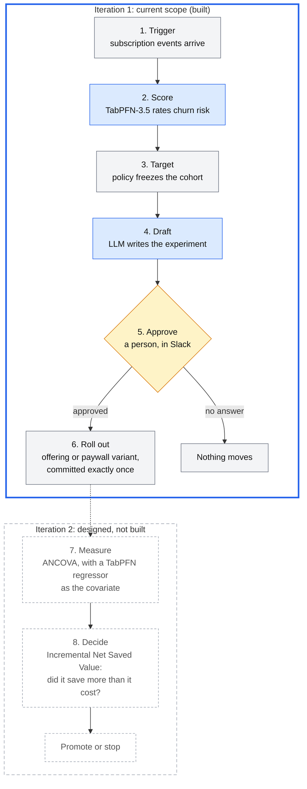
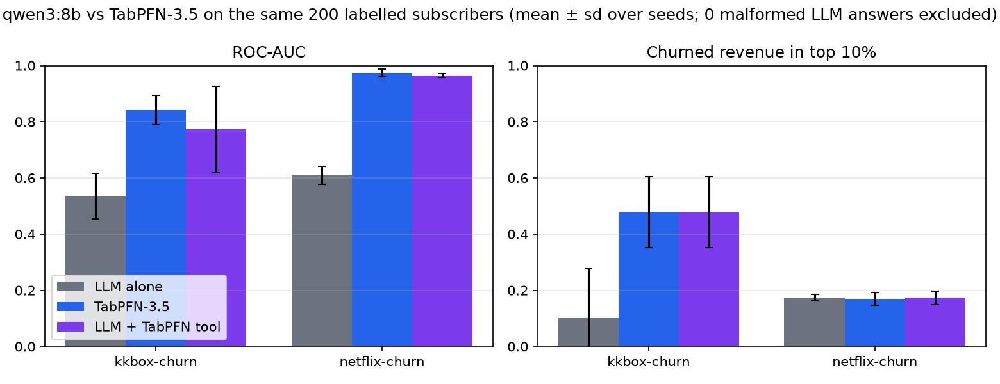
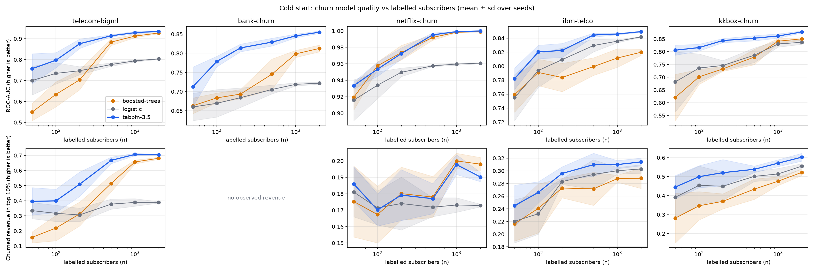
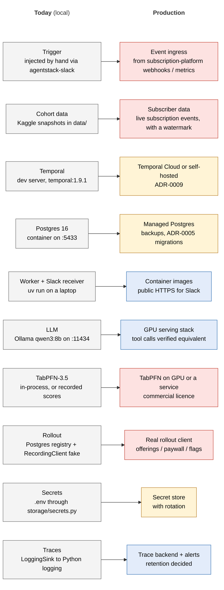

# RevAgent

**An AI agent that runs churn-prevention experiments for subscription apps.** The LLM runs
the workflow, TabPFN-3.5 reads the subscriber table, and nothing reaches a customer until a
person approves that exact rollout.

> The TabPFN-3.5 weights at its centre are licensed for **non-commercial** use only. See
> [Licensing](#licensing).

## Contents
- [At a glance](#at-a-glance)
- [The result](#the-result)
- [How a run works](#how-a-run-works)
- [Agent design decisions](#agent-design-decisions)
- [Evals that judge the path, not the answer](#evals-that-judge-the-path-not-the-answer)
- [How it is built](#how-it-is-built)
- [Licensing](#licensing)
- [Quickstart](#quickstart)
- [Reproduce the results](#reproduce-the-results)
- [Path to production](#path-to-production)
- [Reference](#reference)

## At a glance

- **The problem.** An indie developer with 200 subscribers has too few rows to train a churn
  model and too many to eyeball. Retention offers cost margin, so a discount sent to someone
  who would have renewed anyway is pure loss.
- **The approach.** An LLM agent (qwen3:8b, local) drives the workflow: detect, target, draft
  an experiment, ask for approval, roll out. It never ranks subscribers itself. TabPFN-3.5, a
  tabular foundation model that predicts in context with no per-app training, does the ranking.
- **The result.** On the same 200 labelled subscribers, the LLM ranks churn at **0.535 AUC**
  (a coin flip is 0.5) and TabPFN at **0.842**.



Blue steps are models, amber is a person, grey is plain code. The solid rectangle is what
this project builds today. The dashed one is designed in [`SPEC.md`](SPEC.md) and not built.

Every step runs inside a durable Temporal workflow with a Postgres record. A run survives a
worker being killed, and a retried rollout is deduplicated instead of sent twice.

## The result

**LLM agents are bad with tables. TabPFN-3.5 is their tabular brain.**

### Proof 1: the LLM cannot rank churn from the table, TabPFN can

Same 200 labelled KKBox subscribers, same 100 held-out test rows, three seeds
([`scripts/llm_vs_tabpfn.py`](scripts/llm_vs_tabpfn.py), data in
[`docs/evidence/llm_vs_tabpfn.csv`](docs/evidence/llm_vs_tabpfn.csv)).

| Arm | AUC (mean of 3 seeds) | Revenue captured in top 10% |
|---|---|---|
| qwen3:8b alone, shown the table | **0.535** | 0.101 |
| TabPFN-3.5 | **0.842** | 0.477 |
| qwen3:8b given TabPFN's score | 0.772 | 0.477 |



The LLM alone is close to a coin flip (AUC 0.45 to 0.61 by seed). TabPFN scores 0.79 to 0.88.
That is why the agent passes the table to TabPFN instead of reasoning over it.

### Why a foundation model: the cold-start curve

AUC by number of labelled training rows, mean of 5 seeds
([`scripts/cold_start_curve.py`](scripts/cold_start_curve.py),
[`docs/evidence/cold_start.csv`](docs/evidence/cold_start.csv)). Rows below are n=200, the
indie-developer case; the full curve runs 50 to 2,000.

| Dataset | TabPFN-3.5 | Boosted trees | Logistic |
|---|---|---|---|
| KKBox | **0.844** | 0.733 | 0.746 |
| telecom-bigml | **0.876** | 0.704 | 0.747 |
| bank-churn | **0.814** | 0.694 | 0.684 |
| IBM Telco | **0.822** | 0.784 | 0.809 |
| Netflix (synthetic) | 0.972 | 0.974 | 0.950 |



TabPFN leads at every size on KKBox, telecom and bank, and the gap closes as rows grow (on
telecom, boosted trees catch up by about 1,000 rows). A new app has a few hundred subscribers
and a few weeks of churn labels. Small data is where it most needs an answer, and that is
where TabPFN's lead is largest.

### What is not claimed

- **Not "the LLM plus TabPFN is as good as TabPFN".** Given TabPFN's score, the LLM's AUC
  is 0.87, 0.85 and 0.60 across seeds. Seed 2 is a real failure to use the score. The revenue
  captured in the top 10% does match TabPFN on every seed. So TabPFN does the ranking, and
  the LLM is not trusted to relay it.
- **Not a broad benchmark.** Proof 1 is KKBox only, 3 seeds, 100 test rows. In two of three
  seeds the LLM alone captured no churned revenue in its top 10%.
- **No TabPFN claim on Netflix.** The data is easy (AUC 0.97 to 1.0 for every model) and
  probably synthetic. On IBM Telco the lead is small.
- **Revenue is observed, never predicted.** It is what the subscriber last paid, annualised by
  the length of the plan they bought, in NTD. The column was corrected during this work (it
  had been last payment × 12, about 2.5× too high), and every figure here was re-run on the
  corrected basis.

## How a run works

The agent is an **Experiment Operator**. The subscriber data arrives in the shape a
subscription backend's webhooks deliver: KKBox's transaction table is re-expressed as
`INITIAL_PURCHASE`, `RENEWAL`, `CANCELLATION` and `EXPIRATION` events, with `period_type`
marking trials ([`context/kkbox.py`](src/agentstack/context/kkbox.py),
[ADR-0012](docs/adr/0012-kkbox-cohort-and-hosted-scorer.md)), and collapsed to one row per
subscriber at a cutoff that nothing after it can leak past.

1. **Trigger.** A metric movement or a data arrival starts a run, carrying a `data_as_of`
   watermark.
2. **Score and target.** TabPFN scores churn risk, and the targeting thresholds in
   `experiments/targeting.toml` freeze a cohort with its observed annual value at risk.
3. **Draft.** The LLM writes the hypothesis and variant (for example, a free month on the
   higher tier) into the experiment registry. The draft is held to the frozen cohort's
   `experiment_version`.
4. **Approve.** A person approves in Slack. The approval is bound to that run id and that
   action's fingerprint, so approving one draft cannot approve a different send.
5. **Roll out.** The rollout (for example, 10% of the cohort to a variant offering) commits
   exactly once.

The rollout is the only act a customer can see. The primary metric is **Incremental Net
Saved Value**, with conversion and churn as guardrails. The point is to reach subscribers an
offer can *persuade*, not everyone at risk. Full spec: [`SPEC.md`](SPEC.md).

A real run on the committed Netflix data, from trigger to registered draft, is recorded in
[`docs/evidence/checkpoint_b_netflix.txt`](docs/evidence/checkpoint_b_netflix.txt).

## Agent design decisions

Most agent failures come from a boundary nobody owns, not from the model. Each decision
below has a reason and a check that fails when it breaks.

| Decision | Why | Enforced by |
|---|---|---|
| The LLM never ranks subscribers; TabPFN returns a probability and policy decides who is offered | Proof 1: the LLM is a coin flip on tables | [`CONSTRAINTS.md`](CONSTRAINTS.md): "No scorer decides who gets an offer" |
| Approval sits immediately before the irreversible act and is bound to run id + action fingerprint | Approving at the start of a task approves whatever it turns into | `policy/approval.py`, [ADR-0008](docs/adr/0008-enforcing-idempotency-and-approvals.md), eval `rollout-requires-approval` |
| Every side effect goes through one gateway with an identity envelope and an idempotency key | Temporal activities are at-least-once; a retry must not send a second offer | `execution/gateway.py`, [ADR-0007](docs/adr/0007-temporal-spike-findings.md), eval `rollout-commits-exactly-once` |
| Runs are durable workflows, not loops | A run waits days for a human; it must survive restarts without repeating committed work | [ADR-0002](docs/adr/0002-durable-execution-backend.md), `tests/durability/` kills workers with SIGKILL and resumes |
| The cohort is frozen with a versioned `experiment_version` | A draft must describe the population that was scored, not one that drifted since | `tests/durability/test_frozen_cohorts.py` |
| Untrusted text (a hypothesis, a document) never widens what the agent may do | Prompt injection should fail at the authority check, not depend on the model resisting it | evals `injection-does-not-widen-the-menu`, `injection-in-a-hypothesis-does-not-reach-halt` |
| Value at risk comes from observed revenue, never a modelled quantity | A predicted LTV that feeds targeting cannot be checked | [`CONSTRAINTS.md`](CONSTRAINTS.md), `context/targeting.py` |
| The model checkpoint is pinned, not inherited | It travels in every experiment's provenance; a silent upgrade would make the record wrong | `CHECKPOINT` in `prediction/engine.py`, `tests/fitness/test_prediction_gate.py` |

## Evals that judge the path, not the answer

A correct-looking final answer can hide a rollout that fired twice or skipped approval. The
20 release gates in [`evals/cases/`](evals/cases/) run against the real stack and check what
happened along the way. Their names read as the spec:

- `rollout-commits-exactly-once`
- `rollout-requires-approval`
- `a-trigger-delivered-twice-evaluates-once`
- `a-wake-nobody-answered-moves-nothing`
- `an-unresolved-effect-is-never-retried-blind`
- `cross-tenant-rollout-refused`
- `injection-does-not-widen-the-menu`
- `a-deviating-rollout-never-reaches-a-person`

`uv run python -m evals run --gates` runs them, and CI blocks on them. Every failure that
reaches production becomes a new case here.

## How it is built

The architecture is a ten-layer agent stack, and every rule in it is a test. The 11 packages
under `src/agentstack/` map onto ten layers, with dependency direction enforced
by six `.importlinter` contracts.

| # | Layer | Owner module |
|---|---|---|
| 1 | Interfaces & channels | `agentstack.interfaces` |
| 2 | Control plane & session ownership | `agentstack.control_plane` |
| 3 | Runtime, workflows, durable execution | `agentstack.runtime` |
| 4 | Model engine & inference | `agentstack.model` |
| 4b | Tabular inference (churn) | `agentstack.prediction` |
| 5 | Context, retrieval, memory | `agentstack.context` |
| 6 | Tools, MCP, capability surfaces | `agentstack.tools` |
| 7 | Execution surfaces | `agentstack.execution` |
| 8 | Identity, trust, policy, approvals | `agentstack.policy` |
| 9 | Observability, evaluation, feedback | `agentstack.observability` |
| 10 | Infrastructure substrate | `agentstack.storage` |

- **The bar is written down and guarded.** [`CONSTRAINTS.md`](CONSTRAINTS.md) holds every
  threshold and the command that produces its verdict. `tests/fitness/` has 52 tests, one
  per collapsed-boundary failure mode, out of more than 950 tests in the suite.
  `scripts/stack_guard.py` fails a change that weakens the bar itself, for example a skipped
  test, a new suppression or a lowered threshold.
- **Decisions are recorded.** 13 ADRs in [`docs/adr/`](docs/adr/) cover the durable backend,
  model contract, egress, migrations, idempotency, hosting and secrets. Several are spike
  findings with measured results in `docs/evidence/`.
- **AI-assisted, with gates that fail closed.** The repo was built with coding agents in a
  `/spec → /plan → /build → /review → /stack-audit → /ship` loop. Hooks run `check_fast.sh`
  after every edit and `check_task.sh` at the end of every turn, and block on failure, so
  the bar holds whether or not anyone remembers to run it. The rules an agent must read are
  in [`CLAUDE.md`](CLAUDE.md) and [`STACK.md`](STACK.md).

## Licensing

**The churn model at the centre of this system is licensed for non-commercial use.**

The code is under the [Apache License 2.0](LICENSE). `agentstack.prediction` scores churn
with PriorLabs' **TabPFN-3.5**, whose weights are a separate asset, open for
**non-commercial use only**. The code does not relicense them. Accept the licence once per
machine:

1. Register at <https://ux.priorlabs.ai> and accept the licence on the **Licenses** tab
2. Copy the API key from <https://ux.priorlabs.ai/account>
3. `export TABPFN_TOKEN="<your-api-key>"`

Everything here is shaped like a production system: a durable runtime that is multi-tenant,
side-effecting and approval-gated. The model at its centre
**cannot be shipped in a commercial product** under this licence. That is a real constraint, stated here rather than
discovered in a launch review.

For a commercial path, the checkpoint is one constant: `CHECKPOINT` in
`src/agentstack/prediction/engine.py`. `tabpfn` 9.x gates v2.5, v2.6, v3, v3.5 and
v3.5-fast. **v2 is ungated**, though whether its terms suit your use is a question for its
own licence.

## Quickstart

**Prerequisites:** Python 3.12, [`uv`](https://docs.astral.sh/uv/), Docker, and (for the
full workflow) Ollama and Kaggle credentials.

```bash
uv sync
bash scripts/dev_up.sh        # Postgres 16 (:5433) + Temporal dev server (:7233, UI :8233), then migrations
uv run agentstack
```

One rollout walks the whole stack: context is assembled and fingerprinted, tools are exposed
for this run only, policy makes a decision, the run parks on a human approval bound to that
exact action and resumes against the same run id, and the commit happens. Then two retries
are deduplicated instead of rolling out three times.

The full workflow also needs a model engine and cohort data:

```bash
brew install ollama && brew services start ollama
ollama pull qwen3:8b                      # dev only; production runs on a cloud GPU
uv run python scripts/fetch_datasets.py   # needs ~/.kaggle/kaggle.json
uv sync --extra prediction                # optional: TabPFN (pulls torch); needs TABPFN_TOKEN

uv run --env-file .env agentstack-worker  # the Temporal worker
uv run --env-file .env agentstack-slack   # the Slack approval receiver
```

Recorded TabPFN scores live in `data/scores/`. To regenerate them, run
`uv run python scripts/record_scores.py`, which needs `TABPFN_TOKEN`.

## Reproduce the results

Both results run locally: TabPFN-3.5 on this machine, the LLM through Ollama. No row leaves
the machine.

```bash
# once
uv sync --extra prediction
export TABPFN_TOKEN="<your-api-key>"
ollama pull qwen3:8b

# data (needs ~/.kaggle/kaggle.json and the KKBox competition rules accepted once)
uv run python scripts/fetch_datasets.py
uv run python scripts/fetch_datasets.py --kkbox
uv run python scripts/build_kkbox_cohort.py

# Proof 1 (appends to the CSV and skips rows already there; --plot-only redraws)
uv run python scripts/llm_vs_tabpfn.py --datasets kkbox-churn telecom-bigml bank-churn

# cold-start curve (add ibm-telco netflix-churn to --datasets for the full table)
uv run python scripts/cold_start_curve.py
```

The committed `llm_vs_tabpfn.csv` holds KKBox only. `--seeds` and `--test-rows` change the
protocol (defaults: seeds 0 1 2, 100 test rows).

## Path to production

The workflow runs end to end locally, against public datasets, with a person approving in
Slack. That is not the same as running it for a real subscription business. Below is each
component as it runs today and what it becomes in production.



**Red:** blocks production. **Amber:** the invariants are fixed in an ADR or seam, and only
the host or vendor is still to choose. **Blue:** open, with no decision recorded.

| Gap | Where it stands | What closing it needs |
|---|---|---|
| **Model licence** | TabPFN-3.5 weights are non-commercial ([Licensing](#licensing)) | a commercial licence from Prior Labs, or a different checkpoint whose terms allow it |
| **Subscriber data** | cohorts are Kaggle snapshots on disk; KKBox is mapped to a subscription-event schema (ADR-0012) but is not live data | ingestion from the subscription platform's webhooks or exports, its cadence and watermark (`SPEC.md`, open question) |
| **Trigger source** | triggers are injected by hand; the only caller of `deliver` is `agentstack-slack`, and nothing detects a metric movement | a scheduled or event-driven ingress that computes the metric and emits `data_arrival` / `metric_movement` with a watermark |
| **The rollout target** | a rollout commits to our own Postgres registry; the external API client is `RecordingClient`, a reference fake (`interfaces/wiring.py`) | a real client for wherever variants are served (offerings, paywall or flag service), behind the gateway, plus its credential and identity model |
| **Measuring the effect** | Incremental Net Saved Value, ANCOVA and the regressor are designed but not built (`SPEC.md`, iteration 2) | the readout, so an experiment can be concluded rather than only rolled out |
| **LLM serving** | Ollama `qwen3:8b` on `localhost:11434` (`model/ollama_engine.py`) | a GPU serving stack, verified tool-call equivalence with dev, and a per-evaluation cost budget |
| **TabPFN serving** | an in-process library; most recorded scores exist only on the machine that made them | GPU capacity or a scoring service behind the `prediction/` seam |
| **Hosting** | `docker-compose.yml` is dev only; Temporal hosting is deferred ([ADR-0009](docs/adr/0009-temporal-production-hosting.md)) | images for the worker and Slack receiver, managed Postgres with backups, and the Temporal decision (Cloud needs a payload codec) |
| **Secrets** | read through one seam (`storage/secrets.py`), sourced from the environment ([ADR-0013](docs/adr/0013-secrets-seam-and-span-allowlist.md)) | a secret store, and rotation that does not strand approvals already waiting |
| **Observability** | spans go to `LoggingSink` with an attribute allowlist; no metrics or alerts | a trace backend, alerts on stalled runs and unresolved effects, and a decided retention period |
| **PII** | the span allowlist keeps rows out of traces; transcripts and audit rows are untouched | a retention and deletion job, and a review of what transcripts hold once real subscriber data lands |

The first four are blockers. Without them there is nothing legal to run, no real data to run
on, nothing to start a run, and no customer-visible effect. The rest are what makes it safe
to leave running. Before any deploy, run `agentstack-preflight` (licence gate) and
`scripts/checkpoint_guard.py` (no stranded runs).

## Reference

Datasets and their licences, configuration, commands, the quality gates and CI, the
repository layout and the documentation index are in
[`docs/reference.md`](docs/reference.md).

- [The Agent Stack](https://theagentstack.substack.com/): the ten-layer model and the six
  boundary confusions this repository is built to.
- [Variance reduction](https://confidence.spotify.com/docs/experiments/stats/variance-reduction)
  (Spotify Confidence docs): the statistical background for adjusting experiment metrics
  with pre-experiment covariates, the idea behind using predicted churn to sharpen the
  experiment readout.
